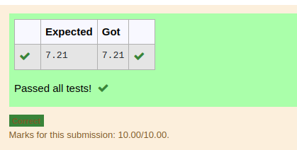

# DISTANCE-BETWEEN-TWO-POINTS

## AIM:
To write a python program to find the distance two 2 points
## ALGORITHM:
### Step 1: 
Get the inputs from the user
### Step 2: 
Classify with x1,x2 and y1,y2 points
### Step 3: 
Substitute the values in the distance formula
### Step 4: 
Import the module
### Step 5: 
Display the out using format function

### PROGRAM:
``` python
#Program to find the distance between two points.
#Developed by:Siva Chandran R
#RegisterNumber:22005531
import math 
l1=[4,2]
l2=[10,6]
d=math.sqrt(((l2[0]-l1[0])**2)+((l2[1]-l1[1])**2))
print("{:.2f}".format(d))
  ```


### OUTPUT:



### RESULT:
This program is used to find the distance between two points
